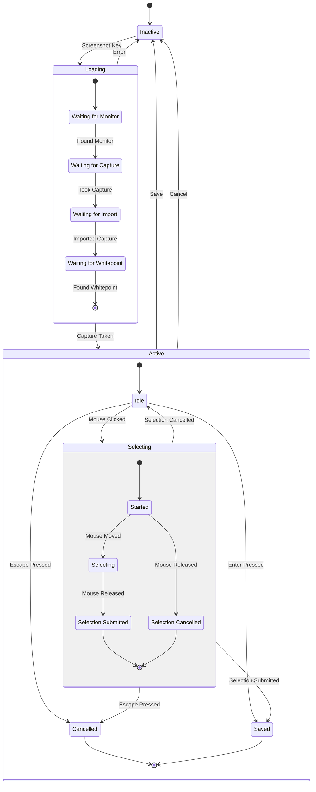

# Design

## Application FSM

```mermaid
stateDiagram-v2
    [*] --> Inactive

    Inactive --> Loading: Screenshot Key
    Loading --> Inactive: Error
    Loading --> Active: Capture Taken
    Active --> Inactive: Save
    Active --> Inactive: Cancel


    state Loading {
        Monitor: Waiting for Monitor
        Capture: Waiting for Capture
        Import: Waiting for Import
        Whitepoint: Waiting for Whitepoint

        [*] --> Monitor
        Monitor --> Capture: Found Monitor
        Capture --> Import: Took Capture
        Import --> Whitepoint: Imported Capture
        Whitepoint --> [*]: Found Whitepoint
    }

    state Active {
        [*] --> Idle
        Idle --> Saved: Enter Pressed
        Idle --> Selecting: Mouse Clicked
        Idle --> Cancelled: Escape Pressed


        Selecting --> Idle: Selection Cancelled
        Selecting --> Cancelled: Escape Pressed
        Selecting --> Saved: Selection Submitted

        Cancelled --> [*]
        Saved --> [*]

        state Selecting {
            InnerSelecting: Selecting
            SelectionCancelled: Selection Cancelled
            SelectionSubmitted: Selection Submitted
            [*] --> Started
            Started --> SelectionCancelled: Mouse Released
            Started --> InnerSelecting: Mouse Moved
            InnerSelecting --> SelectionSubmitted: Mouse Released

            SelectionSubmitted --> [*]
            SelectionCancelled --> [*]
        }   
    }
```
